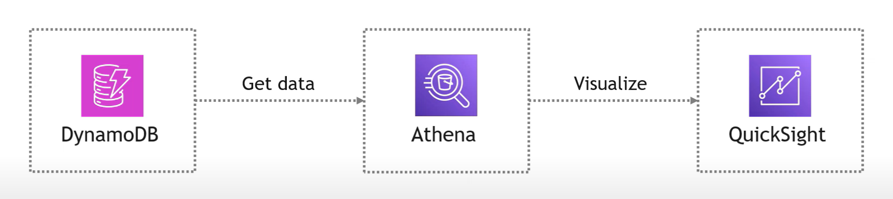

# AWS QuickSight + DynamoDB Analytics

## 📌 Project Overview
This project demonstrates how to visualize NoSQL data stored in AWS DynamoDB using Amazon QuickSight, AWS Athena, and a Lambda Connector. (AWS Free-Tier)

## 🛠️ Tech Stack
- **AWS DynamoDB**: NoSQL database to store task data.
- **AWS Lambda**: Used to connect Athena and DynamoDB.
- **AWS Athena**: Query DynamoDB data using SQL.
- **AWS Glue**: Manages metadata and schema for Athena.
- **Amazon S3**: Stores Athena query results.
- **AWS IAM**: Manages permissions for QuickSight.

## 📊 Key Features
✅ Set up DynamoDB table and populate it with JSON data.  
✅ Use AWS Lambda as a connector between Athena and DynamoDB.  
✅ Configure AWS Glue for schema definition.  
✅ Query DynamoDB data using Athena.  
✅ Visualize data in QuickSight (Bar charts, Donut charts, Tables).  
✅ Secure resource access with IAM roles & policies.  

## 🔥 Architecture Diagram

## 📝 Step-by-Step Guide
1. **Create a DynamoDB Table**
   - Defined Partition Key and Sort Key.
   - Inserted sample JSON records.

2. **Connect Athena to DynamoDB**
   - Used AWS Glue to define schema.
   - Created an S3 bucket for Athena results. (spill location and results - 2 buckets)
   - Configured Athena Lambda Connector.

3. **Set Up QuickSight**
   - Granted IAM permissions.
   - Created a dataset pulling from Athena.
   - Built interactive charts.

4. **Final Visualization**
   - Created a dashboard with different data visualizations.
   - Refreshes data dynamically.

## 🎥 Demo 
Included diagrams and working screenshots in a folder.

## 📂 Project Structure

## Next Step - Adding Frontend/UI

[Frontend: React/Vue.js]  -->  [API Gateway]  -->  [Lambda Function]  -->  [DynamoDB]
                                                           ↓
                                                      [Athena]
                                                           ↓
                                                 [QuickSight Dashboard]

